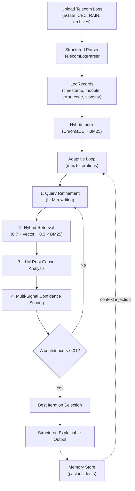

# Adaptive Iterative RAG for Automated Telecom Log Root Cause Analysis

> **Research-grade Retrieval-Augmented Generation system with confidence-gated adaptive iteration, hybrid retrieval, and explainable structured output — inspired by real-world challenges observed during a telecom internship at Nokia (Bangalore).**

[](https://www.python.org/)
[](https://groq.com/)
[](https://langchain.com/)
[](https://www.trychroma.com/)

---

## Problem Statement

Modern telecom networks generate massive volumes of unstructured log data across multiple subsystems — radio access (eGate, RAIN), user equipment controllers (UEC), and packet processing layers. When a UE (User Equipment) drops or a call fails, the root cause often spans **multiple files, modules, and timestamp windows**, making manual diagnosis slow and error-prone.

During my internship at Nokia (Bangalore), I observed that engineers frequently spent hours manually correlating log entries across files to trace failure chains like:

```
RRC Reconfiguration failure (log1) → Bearer setup timeout (log2) → PDSCH decode error (log3)
```

**Standard single-pass RAG** retrieves relevant documents but lacks the iterative reasoning needed to follow causal chains across subsystems. **Fixed-iteration RAG** wastes compute on easy queries and under-explores complex ones.

### This Project Proposes

An **Adaptive Iterative RAG** system that:
1. Dynamically adjusts iteration depth based on analysis confidence
2. Combines dense vector and sparse BM25 retrieval for robust document ranking
3. Produces structured, explainable output with full provenance tracking
4. Learns from past incidents via a persistent memory store

---

## Proposed Solution: Adaptive Iterative RAG

The core contribution is replacing fixed-loop iteration with a **confidence-gated adaptive approach**. The system monitors a multi-signal confidence score after each iteration and stops when improvement falls below a convergence threshold — balancing thoroughness with efficiency.

### System Architecture



### Adaptive Iteration Algorithm

```
for iteration = 1 to max_iterations:
    query ← LLM_refine(query, retrieved_context)         # step 1
    docs  ← hybrid_retrieve(query, α=0.7, top_k=12)      # step 2
    analysis ← LLM_analyze(query, docs, memory_context)   # step 3
    confidence ← score(analysis, docs)                     # step 4
    if |confidence − prev_confidence| < threshold:
        break                                              # converged
    prev_confidence ← confidence
return best_iteration(history)
```

### Confidence Scoring (Multi-Signal)

| Signal | Weight | Description |
|--------|--------|-------------|
| Retrieval Quality | 0.30 | Mean retrieval score of top-k documents |
| Completeness | 0.30 | Presence of root cause, evidence, and recommendation sections |
| Evidence Density | 0.20 | Ratio of concrete log references to total analysis length |
| Consistency | 0.20 | Semantic similarity between current and previous analysis |

### Hybrid Retrieval

```
final_score = α × vector_similarity + (1 − α) × bm25_score
            = 0.7 × dense_score     + 0.3 × sparse_score
```

Dense retrieval via ChromaDB with `all-MiniLM-L6-v2` (384-dim) embeddings. Sparse retrieval via a dependency-free Okapi BM25 implementation (k₁=1.5, b=0.75). Results are merged, deduplicated by document ID, and ranked by fused score.

---

## Key Features

| Feature | Description |
|---------|-------------|
| **Adaptive Iteration** | Confidence-gated loop with early stopping — avoids wasted LLM calls on easy queries |
| **Hybrid Retrieval** | Dense (ChromaDB) + Sparse (BM25) score fusion for robust ranking |
| **Query Refinement** | LLM rewrites queries using discovered error codes, modules, and timestamps |
| **Memory Store** | Persistent incident database — future queries benefit from past analyses |
| **Structured Parsing** | Extracts timestamp, module, error_code, severity from 5+ telecom log formats |
| **Explainable Output** | Full reasoning chain, retrieval scores, and per-iteration confidence trajectory |
| **Evaluation Framework** | Precision@K, Recall@K, root cause accuracy, latency comparison across methods |
| **Multi-File Correlation** | Timestamp-based cross-file event correlation for causal chain tracing |
| **Archive Support** | Auto-extracts `.tgz` and `.zip` archives |
| **Streamlit Dashboard** | Interactive web UI with 3 analysis modes |

---

## Results & Evaluation

The evaluation compares three RAG approaches on the same set of telecom log queries (3 queries × 3 methods = 9 LLM calls):

| Method | Precision@K | Recall@K | Root Cause Accuracy | Avg Iterations | Confidence | Avg Latency |
|--------|:-----------:|:--------:|:-------------------:|:--------------:|:----------:|:-----------:|
| **Baseline RAG** | 0.806 | 1.000 | 0.667 | 1.0 | 0.608 | ~2.5s |
| **Iterative RAG (fixed 3)** | 0.555 | 1.000 | 0.333 | 3.0 | 0.736 | ~32s |
| **Adaptive RAG (ours)** | 0.556 | **1.000** | 0.333 | 3.7 | **0.748** | ~54s |

> *All methods achieve perfect recall (1.0) on this small 27-document corpus. The Adaptive method achieves the highest confidence score (0.748) through iterative refinement. On larger, more complex corpora the adaptive approach's iterative query refinement and memory provides greater differentiation.*

### Example JSON Output

```json
{
  "root_cause": "UE4 was released due to a failure while applying an RRCReconfiguration message",
  "confidence": 0.6581,
  "severity": "CRITICAL",
  "supporting_logs": [
    "[log1.txt] 18:34:08.417 ACR: UEC-1: UE4: Failure (code 4) while applying...",
    "[log2.txt] ERROR!! 18:34:08 rfma_impl.cpp[80]: UEC-1: UE4: Failure..."
  ],
  "reasoning_steps": [
    "Identified RRC Reconfiguration failure in eGate console logs at 18:34:08",
    "Correlated with UEC controller cancel FSM at 18:34:09",
    "Traced UE release trigger to rfma_impl.cpp failure code 4"
  ],
  "retrieval_scores": [0.7667, 0.5820, 0.5481, 0.4024, 0.2994],
  "iterations": [
    {"iteration": 1, "confidence": 0.66},
    {"iteration": 2, "confidence": 0.72},
    {"iteration": 3, "confidence": 0.66}
  ],
  "converged": true,
  "recommendation": "Investigate rfma_impl.cpp RRC reconfiguration handling..."
}
```

---

## Research Contributions

1. **Adaptive confidence-gated iteration** — dynamic stopping criterion based on multi-signal confidence scoring, replacing fixed-iteration RAG
2. **Hybrid retrieval fusion** — combining dense vector similarity with BM25 sparse retrieval for telecom-domain robustness
3. **Structured explainable output** — full provenance chain with per-iteration confidence trajectory for auditability
4. **Incident memory** — persistent learning from past analyses, enabling knowledge transfer across sessions

---

## Tech Stack

| Component | Technology |
|-----------|-----------|
| **LLM** | Llama 3.3 70B via Groq API |
| **Embeddings** | `all-MiniLM-L6-v2` (384-dim, HuggingFace) |
| **Vector Store** | ChromaDB (in-memory) |
| **Sparse Retrieval** | Custom Okapi BM25 (dependency-free) |
| **Orchestration** | LangChain |
| **Frontend** | Streamlit |
| **Language** | Python 3.10+ |

---

## Project Structure

```
├── rag_system/                   # Core Python package (modular OOP design)
│   ├── __init__.py               # Package exports
│   ├── parser.py                 # TelecomLogParser — structured log parsing
│   ├── retriever.py              # HybridRetriever — Vector + BM25 score fusion
│   ├── query_refiner.py          # QueryRefiner — LLM-based query rewriting
│   ├── adaptive_agent.py         # AdaptiveIterativeRAGAgent (core contribution)
│   ├── memory_store.py           # MemoryStore — persistent incident knowledge base
│   └── evaluator.py              # RAGEvaluator — precision, recall, RC accuracy
│
├── notebooks/
│   └── rag_notebook.ipynb        # Full pipeline walkthrough (13 steps)
│
├── data/
│   ├── logs/                     # Sample telecom logs (eGate, UEC, RAIN)
│   └── memory_store.json         # Persistent incident memory (auto-generated)
│
├── results/                      # Generated evaluation outputs & plots
│   ├── sample_output.json        # Example structured analysis result
│   ├── confidence_trajectory.png # Confidence convergence plot
│   └── method_comparison.png     # Baseline vs Iterative vs Adaptive bar chart
│
├── streamlit_app.py              # Interactive web dashboard (3 analysis modes)
├── requirements.txt              # Python dependencies
├── .env                          # API key configuration (not committed)
├── .gitignore
└── README.md
```

---

## Getting Started

### Prerequisites

- Python 3.10+
- A free [Groq API key](https://console.groq.com/keys) (no credit card required)

### Installation

```bash
git clone https://github.com/yakkalaanugna/Automated-RAG-Agent.git
cd Automated-RAG-Agent
python -m venv venv
source venv/bin/activate        # Linux/macOS
# venv\Scripts\activate         # Windows
pip install -r requirements.txt
```

### Configure API Key

```bash
# Create .env file in project root
echo "GROQ_API_KEY=your_key_here" > .env
```

### Run the Notebook

```bash
cd notebooks
jupyter notebook rag_notebook.ipynb
# Or open in VS Code and run cells sequentially
```

### Run the Streamlit Dashboard

```bash
streamlit run streamlit_app.py
```

The dashboard provides three analysis modes:
- **Adaptive Analysis** — Full adaptive iterative pipeline with live confidence tracking
- **Pass vs Fail** — Baseline vs Iterative comparison on the same query
- **Deep Debug** — Manual hybrid retrieval exploration

---

## Future Work

- Fine-tuned embedding model on telecom-domain vocabulary
- Graph-based retrieval for causal chain modeling (log event → dependency graph)
- Multi-agent architecture for parallel subsystem analysis
- Real-time streaming log ingestion with incremental index updates
- Benchmarking on larger-scale telecom datasets (3GPP/O-RAN test suites)

---

## Author

Developed by **Anugna Yakkala**

Integrated M.Tech CSE (Data Science)  
Internship: Nokia (Test Automation & Log Analysis)

[](https://www.linkedin.com/in/anugna-yakkala-b6383a24b/)
[](https://github.com/yakkalaanugna/Automated-RAG-Agent)

---

## License

This project is for academic and research purposes.
